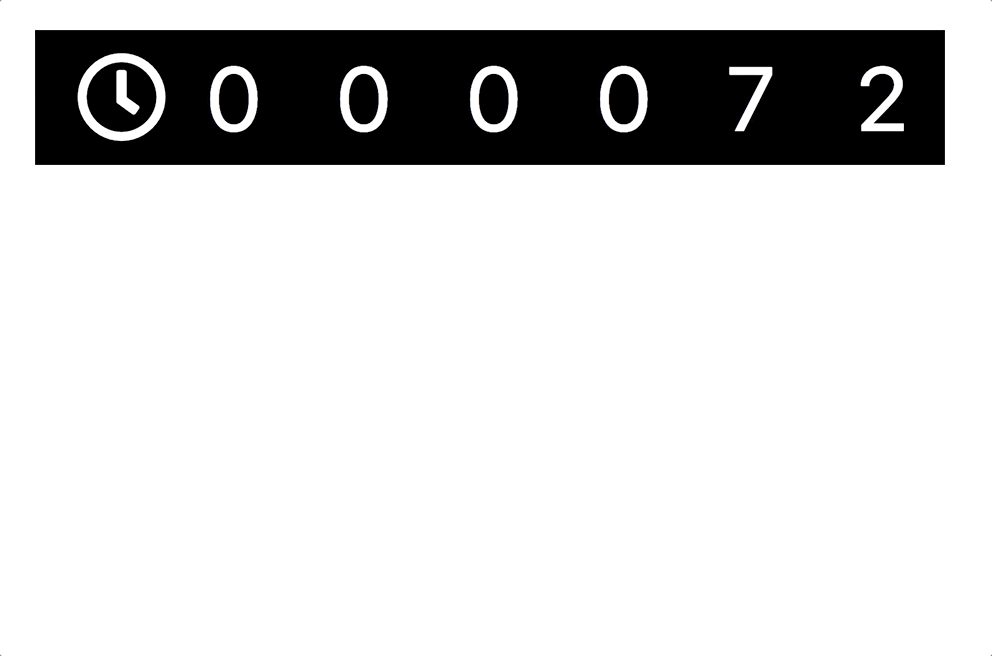

# Seconds Timer with React 

A seconds timer that uses props, react.js  bootstrap, HTML and CSS.



## Live App: [https://scotth527.github.io/seconds-counter/](https://scotth527.github.io/seconds-counter/)

Built from the 4GeeksAcademy react-hello boilerplate here: [https://github.com/4GeeksAcademy/react-hello](https://github.com/4GeeksAcademy/react-hello)

### Run the Project from Cloud 9 IDE

##### Make sure you have node version 8
```sh
$ nvm install 8
$ nvm use 8
$ node -v
```

#### Then run the app!
```sh
$ npm run c9
```

##### Install the npm package when changes are made to package.json:
```sh
$ npm install
```

##### Re-build bundle for deployment outside of GitHub Pages

```sh
$ npm run build
```